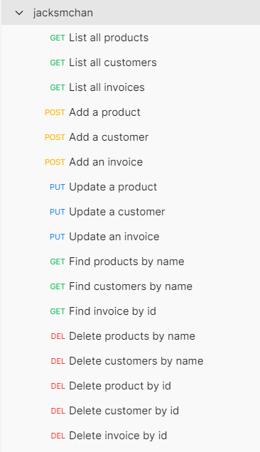

# Customers' purchases Manager
- Author: Sze Ming Chan (jack_chan_@hotmail.com)
- Source: <https://github.com/jacksmchan/DFESW7_Final-Project>

## What is it?
Customers' purchases Manager (CPM) is used to help manager in tracing the storage of products, customers as well as their purchase history.

## Knowledge/tools Required
- JDK v11
- Maven v3.8.4
- SpringBoot v2.1.3.RELEASE
- H2 v1.4.197
- Hibernate v5.3.7.Final
- Git v2.34.1.windows.1

## Development Guide
1. Install JDK v1.8+
1. Install Maven v3.8+
1. Install Git v2.34.1.windows.1+
1. Clone the source code ```git clone https://github.com/jacksmchan/DFESW7_Final-Project.git```
1. Run ```mvn spring-boot:run``` under the root of this project

## Testing
1. Import ```supporting\jacksmchan.postman_collection.json``` with Postman  
   
1. Request ```List all products``` is used to list all products
1. Request ```List all customers``` is used to list all customers
1. Request ```List all invoices``` is used to list all invoices
1. Request ```Add a product``` is used to add a product
1. Request ```Add a customer``` is used to add a customer
1. Request ```Add an invoice``` is used to add an invoice
1. Request ```Update a product``` is used to update a product
1. Request ```Update a customer``` is used to update a customer
1. Request ```Update an invoice``` is used to update an invoice
1. Request ```Find products by name``` is used to find all products whose name contains the given string
1. Request ```Find customers by name``` is used to find all customers whose name contains the given string
1. Request ```Find invoice by id``` is used to find the invoice by its id
1. Request ```Delete products by name``` is used to delete all products whose name contains the given string
1. Request ```Delete customers by name``` is used to delete all customers whose name contains the given string
1. Request ```Delete product by id``` is used to delete the product by its id
1. Request ```Delete customer by id``` is used to delete the customer by its id
1. Request ```Delete invoice by id``` is used to delete the invoice by its id
